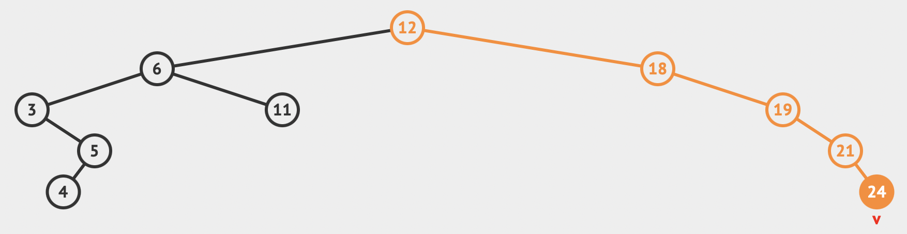

# Binary Search Tree Cheatsheet

In computer science, a binary search tree (BST), also called an ordered or sorted binary tree, is a rooted binary tree
data structure with the key of each internal node being greater than all the keys in the respective node´s left subtree
and less than the ones in its right subtree.

The time complexity of operations on the binary tree is directly proportional to the height of the tree.

Binary search trees allow binary search for fast lookup, addition, and removal of data items. Since the nodes in a BST
are laid out in such a way that each comparison skips about half of the remaining tree, the lookup performance is 
proportional to that of the binary logarithm. [[1]](https://en.wikipedia.org/wiki/Binary_search_tree)

# Table of Content
- [Tree Structures](#tree-structures)
- [Definitions](#definitions)
- [BST Python Implementation](#bst-python-implementation)
- [Tree Traversal Methods](#tree-traversal-methods)
    * [Inorder Traversal (Left, Root, Right)](#inorder-traversal-left-root-right)
    * [Preorder Traversal (Root, Left, Right)](#preorder-traversal-root-left-right)
    * [Postorder Traversal (Left, Right, Root)](#postorder-traversal-left-right-root)
- [About space complexity](#about-space-complexity)
    * [Definition of Iterative and Recursive Algorithms](#definition-of-iterative-and-recursive-algorithms)
    * [The iterative way](#the-iterative-way)
- [Wrap up Snippet (BST with recursive traversal)](#wrap-up-snippet-binary-search-tree-with-recursive-traversal)
- [Wrap up Snippet (BST with iterative traversal)](#wrap-up-snippet-binary-search-tree-with-iterative-traversal)
- [Ressources and Credits](#ressources-and-credits)

## Tree Structures

Note: The following structures do not represent a binary search tree. This is just a quick comparison between the three
tree structures.

**Full Binary Tree**: A full Binary tree is a special type of binary tree in which every parent node/internal node 
has either two or no children.
```
         18
       /    \   
     15      20    
    /  \       
   40   50   
  /  \
 30  50
```

**Complete Binary Tree**: A complete binary tree is just like a full binary tree, but with two major differences
- Every level must be completely filled
- All the leaf elements must lean towards left
- The last leaf element might not have a right sibling, i.e. a complete binary tree does not have to be a full binary tree.
```
            18
       /         \  
     15           30  
    /  \         /  \
  40    50     100   40
 /  \   /
8   7  9 
```

**Perfect Binary Tree**: A perfect binary tree is a type of binary tree in which every internal node has exactly two 
child nodes and all the leaf nodes are at the same level.
```
           18
       /       \  
     15         30  
    /  \        /  \
  40    50    100   40
```

## Definitions

**Node**: A data structure consisting of a value, together with left and right reference to other nodes.

```python
class Node:
    def __init__(self, value):
        self.value = value
        self.left = None
        self.right = None
```

**Root**: The top node without a parent

**Edge**: The connection between two nodes

**Leaf**: A node without any children

```python
# How to recognize a leaf node
if not node.left and not node.right
```

**Depth**: The number of edges from the tree´s root node to the current node (root node has depth 0)

**Height**: The number of edges on the longest path from the node to a leaf (leaf note has height 0)

**Diameter**: The diamenbter of a binary tree is the lenght of the longest path between any two nodes in a tree. 
This path may or may not pass through the root.


Fig: A binary search tree of size 9 and depth 3, with 8 at the root.

## BST Python Implementation
```python
class BSTNode:
    def __init__(self, val=None):
        self.left = None
        self.right = None
        self.val = val

    def insert(self, val):
        if not self.val:
            self.val = val
            return
        if self.val == val:
            return
        if val < self.val:
            if self.left:
                self.left.insert(val)
                return
            self.left = BSTNode(val)
            return
        if self.right:
            self.right.insert(val)
            return
        self.right = BSTNode(val)

        
if __name__ == '__main__':
    nums = [12, 6, 18, 19, 21, 11, 3, 5, 4, 24, 18]
    bst = BSTNode()
    for num in nums:
        bst.insert(num)
```

## Tree Traversal Methods

Unlike linear data structures (Array, Linked List, Queues, Stacks, etc.) which have only one logical way to traverse
them, trees cann be traversed in different ways. Following are the generally used ways for traversing trees.

Using following BST as an example:




### Inorder Traversal (Left, Root, Right)

Algorithm Inorder(tree)
- Traverse the left subtree, i.e., call Inorder(left-subtree)
- Visit the root
- Traverse the right subtree, i.e., call Inorder(right-subtree)

Inorder traversal gives nodes, in non-decreasing order. To get nodes of BST in non-increasing order, a variation of
Inorder traversal where Inorder traversal reversed can be used (Right, Root, Left).

Example: Inorder traveral for the above tree is ```[3, 4, 5, 6, 11, 12, 18, 19, 21, 24]```

```python
def inorder(self, vals):
    if self.left is not None:
        self.left.inorder(vals)
    if self.val is not None:
        vals.append(self.val)
    if self.right is not None:
        self.right.inorder(vals)
    return vals
```

### Preorder Traversal (Root, Left, Right)

Algorithm Preorder(tree)
- Visit the root
- Traverse the left subtree, i.e. call Preorder(left-subtree)
- Traverse the right subtree, i.e. call Preorder(right-subtree)

Preorder traversal is used to create a copy of the tree. Preorder traversal is also used to get prefix expression on an 
expression tree. 

Example: Preorder traversal for the above tree is ```[12, 6, 3, 5, 4, 11, 18, 19, 21, 24]```

```python
def preorder(self, vals):
    if self.val is not None:
        vals.append(self.val)
    if self.left is not None:
        self.left.preorder(vals)
    if self.right is not None:
        self.right.preorder(vals)
    return vals
```

### Postorder Traversal (Left, Right, Root)

Algorithm Postorder(tree)
- Traverse the left subtree, i.e. call Postorder(left-subtree)
- Traverse the right subree, i.e. call Postorder(right-subtree)
- Visit the root

Postorder traversal is used to delete the tree. Postorder traversal is also useful to get the postfix expression of an
expression tree.

Example: Postorder traversal for the above tree is ```[4, 5, 3, 11, 6, 24, 21, 19, 18, 12]```

```python
def postorder(self, vals):
    if self.left is not None:
        self.left.postorder(vals)
    if self.right is not None:
        self.right.postorder(vals)
    if self.val is not None:
        vals.append(self.val)
    return vals
```

## About space complexity

The major difference between the recursive version of binary search as shown above and an iterative approach is that the
recursive version has a space complexity of ``O(log N)`` while the iterative version has a space complexity of ``O(1)``.
Hence, even though recursive version may be easy to implement, the iterative version is more efficient.

### Definition of Iterative and Recursive Algorithms

In the case of Iterative algorithms, a certain set of statements are repeated a certain number of time.An Iterative 
algorithm will use looping statements such as for loop, while loop or do-while loop to repeat the same steps number 
of time.

Recursive algorithm, a function calls itself again and again till the base condition(stopping condition) is satisfied.

### The iterative way

For the sake of completion here are the iterative traversal functions.

**Inorder**
```python
def in_order(self):
    current = self
    stack = []
    res = []

    while True:
        if current is not None:
            stack.append(current)
            current = current.left

        elif (stack):
            current = stack.pop()
            res.append(current.val)
            current = current.right

        else:
            break
    return res
```

**Preorder**
```python
def pre_order(self):
    current = self
    stack = []
    res = []
    stack.append(current)
    while stack:
        node = stack.pop()
        res.append(node.val)
        if node.right is not None:
            stack.append(node.right)
        if node.left is not None:
            stack.append(node.left)
    return res
```

**Postorder**
```python
def post_order(self):
    current = self
    last = None
    stack = []
    res = []

    while True:
        if current and current is not last:
            stack.append(current)
            current = current.left
        elif stack:
            tos = stack[-1]
            if tos.right and tos.right is not current:
                current = tos.right
            else:
                current = last = stack.pop()
                res.append(last.val)
        else:
            break
    return res
```


## Wrap up Snippet (Binary Search Tree with recursive traversal)
```python
class BSTNode:
    def __init__(self, val=None):
        self.left = None
        self.right = None
        self.val = val

    def insert(self, val):
        if not self.val:
            self.val = val
            return
        if self.val == val:
            return
        if val < self.val:
            if self.left:
                self.left.insert(val)
                return
            self.left = BSTNode(val)
            return
        if self.right:
            self.right.insert(val)
            return
        self.right = BSTNode(val)

    def get_min(self):
        current = self
        while current.left is not None:
            current = current.left
        return current.val

    def get_max(self):
        current = self
        while current.right is not None:
            current = current.right
        return current.val

    def delete(self, val):
        if self is None:
            return self
        if val < self.val:
            if self.left:
                self.left = self.left.delete(val)
            return self
        if val > self.val:
            if self.right:
                self.right = self.right.delete(val)
            return self
        if self.right is None:
            return self.left
        if self.left is None:
            return self.right
        min_larger_node = self.right
        while min_larger_node.left:
            min_larger_node = min_larger_node.left
        self.val = min_larger_node.val
        self.right = self.right.delete(min_larger_node.val)
        return self

    def exists(self, val):
        if val == self.val:
            return True

        if val < self.val:
            if self.left is None:
                return False
            return self.left.exists(val)

        if self.right is None:
            return False
        return self.right.exists(val)

    def preorder(self, vals):
        if self.val is not None:
            vals.append(self.val)
        if self.left is not None:
            self.left.preorder(vals)
        if self.right is not None:
            self.right.preorder(vals)
        return vals

    def inorder(self, vals):
        if self.left is not None:
            self.left.inorder(vals)
        if self.val is not None:
            vals.append(self.val)
        if self.right is not None:
            self.right.inorder(vals)
        return vals

    def postorder(self, vals):
        if self.left is not None:
            self.left.postorder(vals)
        if self.right is not None:
            self.right.postorder(vals)
        if self.val is not None:
            vals.append(self.val)
        return vals
```

## Wrap up Snippet (Binary Search Tree with iterative traversal)
```python
class BSTNode:
    def __init__(self, val=None):
        self.left = None
        self.right = None
        self.val = val

    def insert(self, val):
        if not self.val:
            self.val = val
            return
        if self.val == val:
            return
        if val < self.val:
            if self.left:
                self.left.insert(val)
                return
            self.left = BSTNode(val)
            return
        if self.right:
            self.right.insert(val)
            return
        self.right = BSTNode(val)

    def in_order(self):
        current = self
        stack = []
        res = []

        while True:
            if current is not None:
                stack.append(current)
                current = current.left

            elif (stack):
                current = stack.pop()
                res.append(current.val)
                current = current.right

            else:
                break
        return res

    def pre_order(self):
        current = self
        stack = []
        res = []
        stack.append(current)
        while stack:
            node = stack.pop()
            res.append(node.val)
            if node.right is not None:
                stack.append(node.right)
            if node.left is not None:
                stack.append(node.left)
        return res

    def post_order(self):
        current = self
        last = None
        stack = []
        res = []

        while True:
            if current and current is not last:
                stack.append(current)
                current = current.left
            elif stack:
                tos = stack[-1]
                if tos.right and tos.right is not current:
                    current = tos.right
                else:
                    current = last = stack.pop()
                    res.append(last.val)
            else:
                break
        return res


if __name__ == '__main__':
    nums = [12, 6, 18, 19, 21, 11, 3, 5, 4, 24, 18]
    bst = BSTNode()
    for num in nums:
        bst.insert(num)

    print(bst.in_order())
    print(bst.pre_order())
    print(bst.post_order())

```

## Ressources and Credits

- [Wikipedia](https://en.wikipedia.org/wiki/Binary_search_tree)
- [Jerry An - Binary Tree Cheat Sheet for next Interview](https://jerryan.medium.com/binary-tree-cheat-sheet-for-next-interview-7b442a84d70)
- [Lane Wanger - Writing a Binary Search Tree in Python](https://blog.boot.dev/computer-science/binary-search-tree-in-python/)