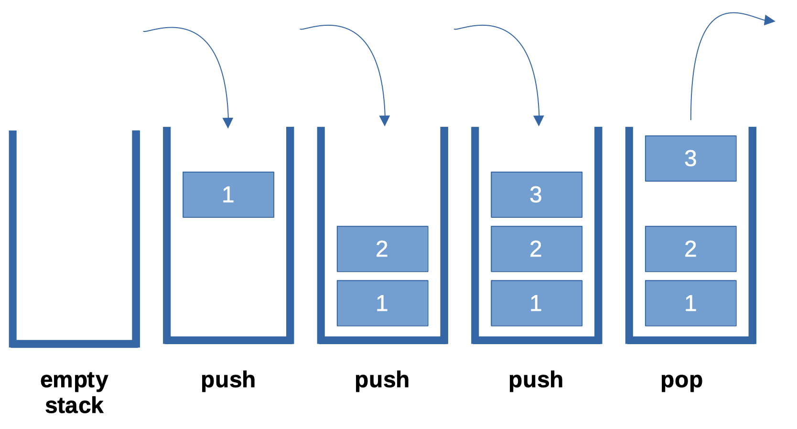

# Stack Cheatsheet

A stack is a linear structure that follows the principle of **Last In First Out (LIFO)**. This means the last element
inserted inside the stack is removed first.

You can think of the stack data structure as the pile of car tires on top of another. 


Figure1: Stack representation almost "similar" to a pile of car tires. 

Here you can:
- Put a new tire on top
- Remove the top tire

And, if you want to plate at the bottom, you must first remove all other tires on top. This is exactly how the stack
data structure works.

## LIFO Principle of Stack

In programming terms, putting an item on top of the stack is calles **push** and removing an item is called **pop**.



In the above image, although item 3 was kept last, it was removed first. This is exactly how the **LIFO** works.

## Basic Operations of Stack

There are some basic operations that allow us to perform different actions on a stack.

- **Push**: Add an element to the top of a stack
- **Pop**: Remove an element from the top of a stack
- **IsEmpty**: Check if the stack is empty
- **IsFull**: Check if the stack is full
- **Peek**: Get the value of the top element withouth removing it


## Python Implementation
```python
class Stack:
    def __init__(self):
        self.items = []

    def isEmpty(self):
        return self.items == []

    def push(self, item):
        self.items.append(item)

    def pop(self):
        return self.items.pop()

    def peek(self):
        return self.items[len(self.items) - 1]

    def size(self):
        return len(self.items)

    def __str__(self):
        return str(self.items)


if __name__ == '__main__':
    # Create an empty stack
    s = Stack()
    print(s)

    # Check if stack is empty
    print(s.isEmpty())

    # Push characters into stack
    chars = ['a', 'b', 'c', 'd']
    for c in chars:
        s.push(c)
    print(s)

    # Remove last character from stack
    s.pop()
    print(s)

    # Just peek into the stack, this won´t remove the character
    s.peek()
    print(s)

```

## Stack Time Complexity

For the array-based implementation of a stack, the push and pop operations take constant time, i.e. ``O(1)``